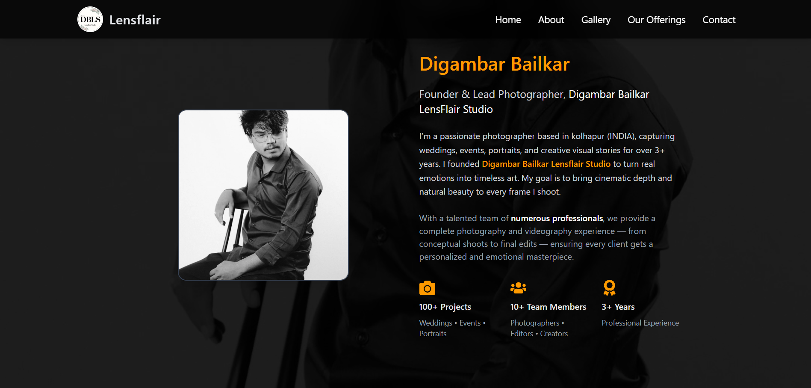

# 📸✨ BDLS Photography Portfolio Website



---

## 🌅 About the Website

Welcome to the **BDLS Photography Portfolio**, a modern and elegant photography showcase created for **Digambar Bailkar**, the founder of **BDLS Photography Studio** 🎥📷  

This portfolio is designed to highlight the photographer’s **artistic vision**, **teamwork**, and **services** through stunning visuals, creative storytelling, and smooth animations.  

The website gives potential clients a complete view of BDLS Studio’s professionalism — from **beautiful image galleries** to **detailed about sections** and **contact forms** for easy bookings.  

> 🖤 “Photography is the story we fail to put into words.” – Destin Sparks  

### 🛠️ Tech Stack
| 🚀 Technology | 🧩 Purpose |
|---------------|------------|
| **React (Vite)** ⚡ | Component-based structure & fast bundling |
| **Tailwind CSS** 🎨 | Utility-first CSS framework for responsive design |
| **Framer Motion** 🌀 | Smooth animations and transitions |
| **ScrollReveal.js** 👀 | On-scroll fade-in and reveal effects |
| **React Router DOM** 🗺️ | Seamless navigation between pages |

---
---

## 🧩 Key Features
✨ **Animated Landing Page** – Smooth motion effects with Framer Motion  
📸 **Gallery Showcase** – Professionally structured grid layout  
👤 **About Section** – Photographer bio, team, and services  
📞 **Contact Page** – Call-to-action with background visuals  
⚡ **Performance Optimized** – Powered by Vite  
📱 **Fully Responsive** – Adapts perfectly to all devices  

---

## 🚀 Getting Started

Follow these steps to run the project locally 👇
```bash
git clone https://github.com/yourusername/bdls-photography.git
cd bdls-photography
npm install
npm run dev
npm run build
```
---

## 🌈 Highlights

* 🎬 **Scroll animations** with ScrollReveal
* 💡 **Modern, dark-themed aesthetic** with a cinematic touch
* 🖥️ **Component-based structure** for easy scalability
* 🧠 **SEO optimized** for better reach
* 🌍 **Fast and lightweight** thanks to Vite bundling

---

## 👨‍💻 Developer Info

Developed with ❤️ by **Sujay Pagam**

---

> 🏆 *A fusion of creativity and code – turning art into a digital experience.*

